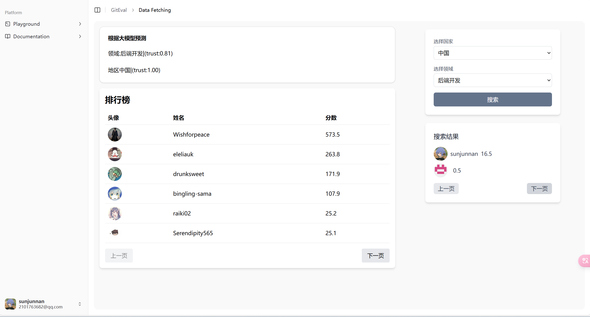
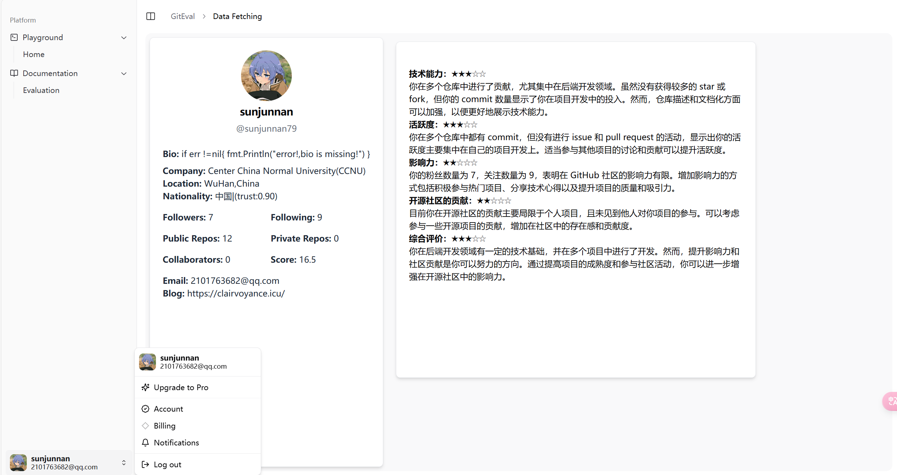
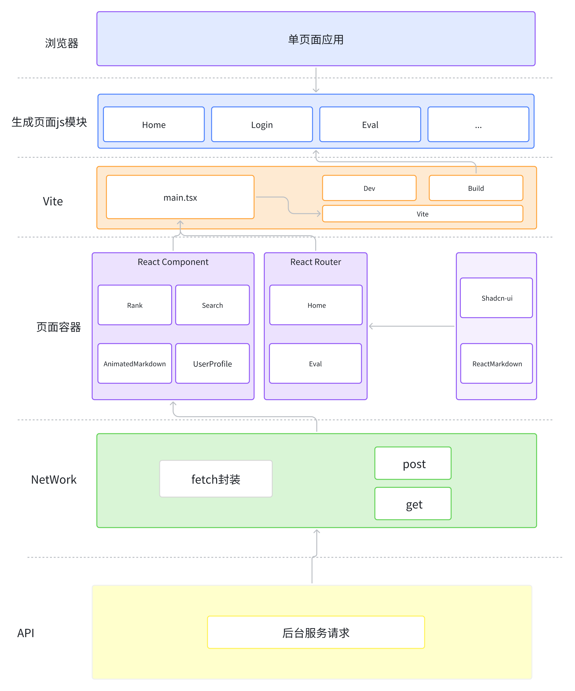
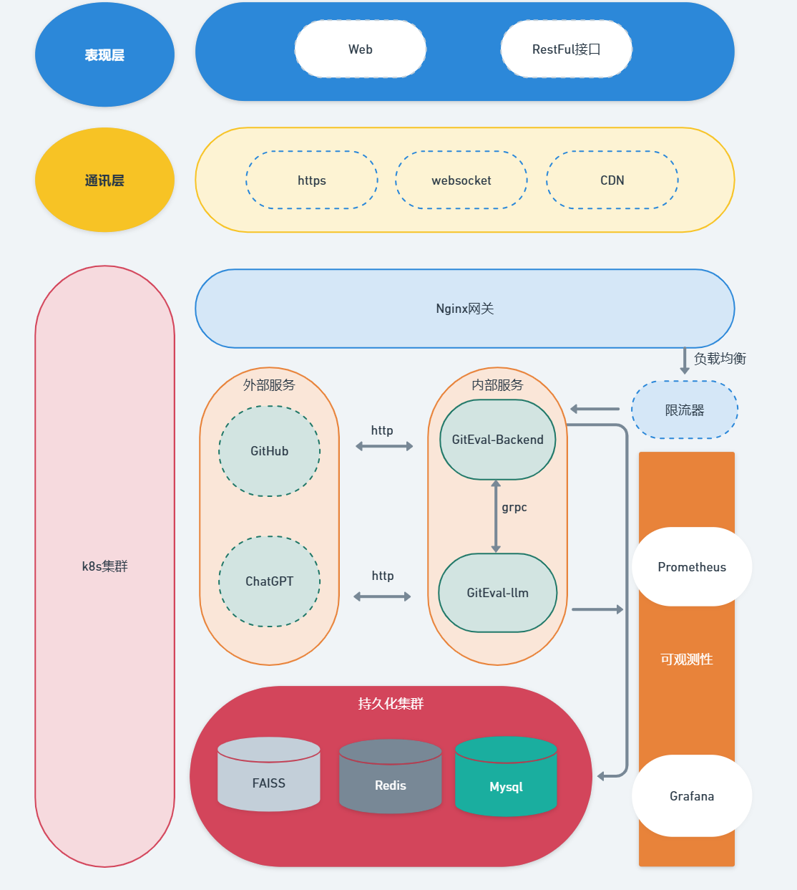

# GitHub 开源项目开发者评估应用

## 项目简介
该项目基于 GitHub 开源项目数据，开发一款开发者评估 Web 应用，通过计算开发者在项目中的贡献度和技术能力，生成其 TalentRank，并提供开发者的领域、所属国家（Nation）等信息。本项目包含三个主要服务：

- [**GitEval-FrontEnd**](https://github.com/GitEval/GitEval-FrontEnd)：提供前端界面，展示开发者评估结果。
- [**GitEval-Backend**](https://github.com/GitEval/GitEval-Backend)：处理业务逻辑和数据处理。
- [**GitEval-llm**](https://github.com/GitEval/GitEval-llm)：集成大语言模型，作为 backend 的依赖服务，负责预测、评价等工作。

## 功能展示

💽💽💽Demo: https://github.com/GitEval/GitEval-Instructions/blob/main/img/display.mov
<br/>

📢📢📢公网访问地址:http://47.92.102.209:5173/，偶尔会出现github授权超时问题。。。

---

## 页面展示

### 登录


### 首页



### 评估



## 服务架构

### 1. GitEval-backend
负责处理核心的业务逻辑

#### 功能：
- 登录，登出
- 从 GitHub 获取开发者及其开源项目数据
- 计算开发者的 TalentRank，实现搜索等功能
- 提供 API 给前端展示

#### 技术栈：
- 开发语言：Golang
- 框架：Gin + GORM
- 服务间通信：gRPC
- 缓存：Redis + sync.Map
- 数据持久化：MySQL
- 用户登录：JWT
- 依赖注入：Wire
- 接口文档生成：Swag

---

### 2. GitEval-FrontEnd
GitEval-FrontEnd 是一个展示开发者评估信息的前端界面。该项目旨在提供一个直观、易用的平台，让用户能够查看开发者的 TalentRank 排序、按领域和国家筛选开发者，并查看开发者的详细评估信息。

#### 功能列表：
1. **TalentRank 排序**：展示开发者的 TalentRank 排名，帮助用户快速了解开发者的综合能力。
2. **领域和国家筛选**：用户可以根据领域和国家筛选开发者，以便更精确地找到所需的人才。
3. **详细评估信息**：提供开发者的详细评估信息，包括技能、经验、项目经历等，帮助用户全面了解开发者的能力。

#### 技术栈：
- 框架：React
- 主要开发语言：TypeScript
- UI 组件库：ShadCN-ui
- 样式管理：Tailwind CSS

---

### 3. GitEval-llm
利用大语言模型进行领域和地区推断，以及分析开发者的 GitHub 活动，整理开发者活动并进行能力总结。

#### 功能：
- **getNation**：获取推断国家
- **getDomain**：获取推断技术领域
- **getEvaluation**：获取对用户的技术评估

---

## 实现功能

### 1. 登录登出
使用 GitHub 进行授权登录
- 通过 GitHub 应用授权实现登录
- 使用 JWT 鉴权机制和用户缓存池实现用户状态控制

### 2. 个人用户信息显示
获取用户整理后的个人信息
- 通过 GitHub API 获取用户个人信息，整理后持久化到数据库中

### 3. TalentRank 评价/评级
根据开发者在 GitHub 项目中的贡献，计算其技术能力（TalentRank）

#### 主要依据：
- 项目的重要性：如 Star 数、Fork 数、贡献者数、项目大小
- 开发者的贡献度：如提交次数、PR 数量等

### 4. 推断开发者的 Nation
通过 GitHub 开发者好友关系网络推测其所属国家（Nation）

#### 主要依据：
- 通过获取 follower 和 following 的所在位置进行向量搜索，获取可能存在的位置
- 再通过大模型并结合用户自身情况进行预测

### 5. 推断开发者的主要领域
通过 GitHub 的开发者的仓库中的数据为依据进行推断

#### 主要依据：
- 项目中的 README：提供了对此项目的基本认识
- 主要编程语言：提供了项目的主要实现方式
- 用户个人简介：提供了用户的个人特点
- 主要参与项目：提供了用户的活跃倾向

### 6. 开发者搜索
根据开发者的 GitHub 活跃情况进行 TalentRank 排序
- 支持按领域和国家筛选，帮助用户找到符合特定要求的开发者
- 支持分页筛选

### 7. 技术能力评估
集成大语言模型服务（如 GPT-4）自动分析开发者的 GitHub Profile，基于：
- 开发者在 GitHub 进行的事件
- 开发者的个人仓库
- 开发者的授权身份信息

### 8. 置信度显示
对于所有推测的数据（如开发者所属国家），我们将为每个数据点提供置信度，低置信度的数据将以 N/A 进行显示。

---

## 项目架构图
该项目包含三个主要服务，每个服务有独立的仓库和配置。
### GitEval-FrontEnd


---

### GitEval-Backend



## 如何运行程序？

1. 将 `conf/config-example.yaml` 改为 `config.yaml`，然后配置相关信息

2. 构建镜像：
`docker build -t giteval:v1 .`
或者考虑直接从阿里云拉取本服务的镜像（已上传）
```bash
##拉取镜像
docker pull crpi-vgud82zncz8nwfuc.cn-hangzhou.personal.cr.aliyuncs.com/qianchengsijin4869/giteval:app
##修改tag
docker tag crpi-vgud82zncz8nwfuc.cn-hangzhou.personal.cr.aliyuncs.com/qianchengsijin4869/giteval:app giteval:v1
```
​	同理,修改llm仓库中的config/dev.yaml文件为config/config.yaml并修改相关配置

​	构建镜像:`docker build -t llm:v1 .`

​	如果需要，也可以拉取llm服务的镜像（已上传）

```bash
##拉取镜像
##拉取镜像
docker pull crpi-vgud82zncz8nwfuc.cn-hangzhou.personal.cr.aliyuncs.com/qianchengsijin4869/giteval:llm
##修改tag
docker tag crpi-vgud82zncz8nwfuc.cn-hangzhou.personal.cr.aliyuncs.com/qianchengsijin4869/giteval:llm llm:v1
```
前端仓库构建:`docker build -t frontend:v1 .`

3. 执行docker-compose up -d运行，执行前请确保构建好所有服务的镜像

---


## 团队分工

| 团队成员 | 主要工作 |
| -------- | -------- |
| 孙俊楠    | llm部分设计，后端llm相关部分业务代码实现，代码审查 |
| 陈诚   | 后端架构设计，搜索，rank等业务功能的实现，部署 |
| 单禹嘉     | 前端开发，包括前端架构设计、前端业务模块实现等 |
